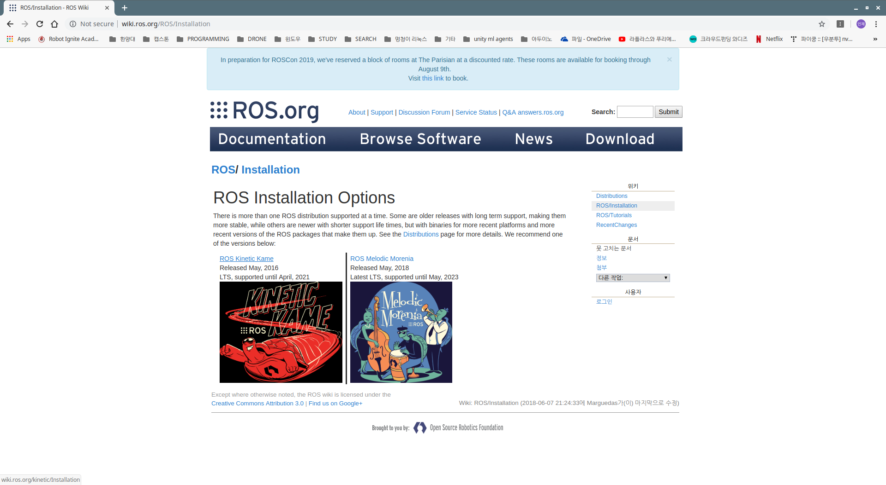
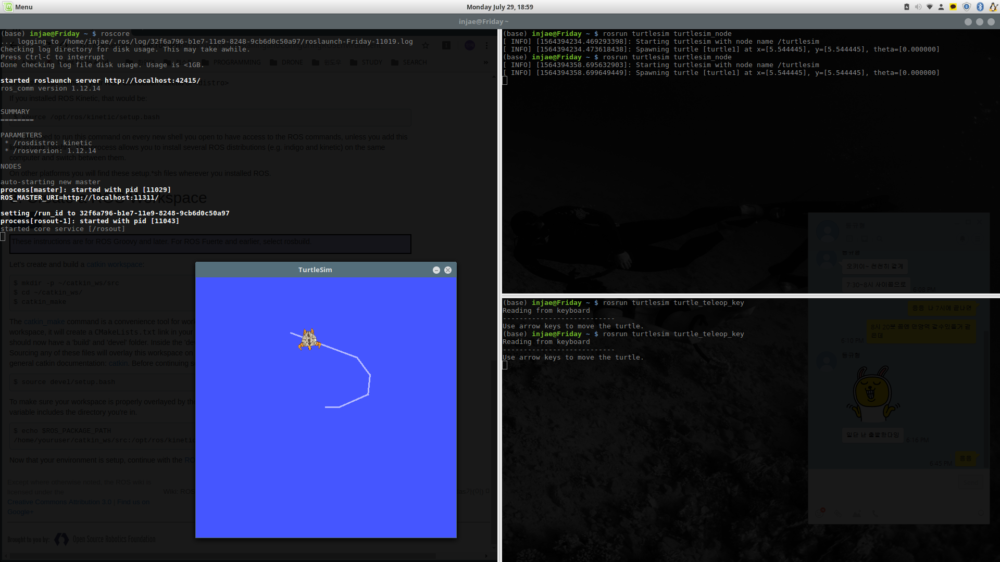
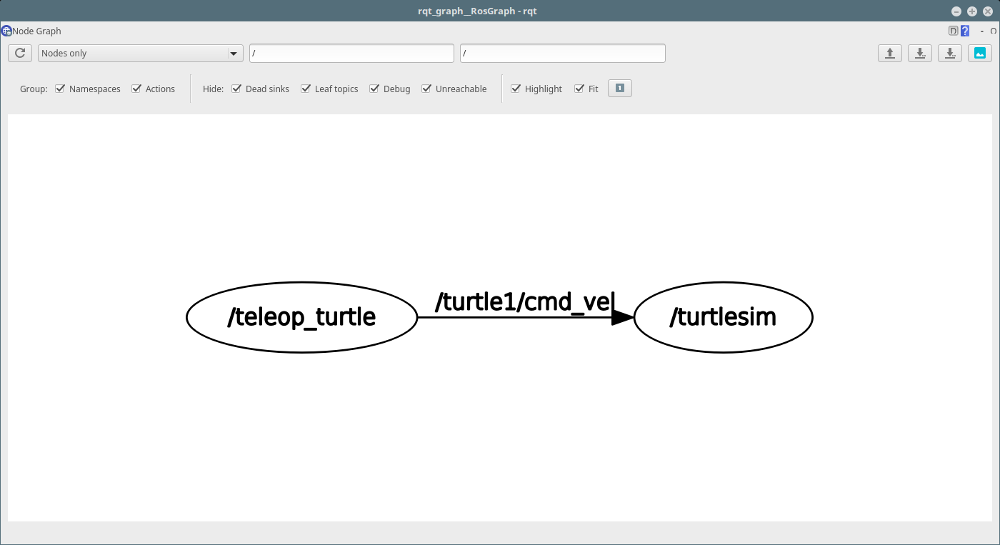

# ROS 설치 
```
작성일 19년 12월 27일
작성자 황인재
최종 수정일 19년 12월 27일
```


## 0. ROS 설치전 권장 사항
### ROS 와 충돌 방지

>sudo apt remove modemmanager

>sudo usermod -a -G dialout  <user name>

### 리눅스 민트의 경우 환경 변수 변경 필요
> cd /etc  

> sudo gedit lsb-release  

* 변경 전
    ```
    DISTRIB_ID=LinuxMint
    DISTRIB_RELEASE=19.1
    DISTRIB_CODENAME=tessa
    DISTRIB_DESCRIPTION="Linux Mint 19.1 Tessa"
    ```
* 변경 후
    ```
    DISTRIB_ID=Ubuntu
    DISTRIB_RELEASE=18.04
    DISTRIB_CODENAME=bionic
    DISTRIB_DESCRIPTION="Ubuntu 18.04 LTS"
    ```
    
---
## 1. ROS 설치
```
참고 사이트
http://wiki.ros.org/ROS/Installation
```


### repository 추가

> sudo sh -c 'echo "deb http://packages.ros.org/ros/ubuntu $(lsb_release -sc) main" > /etc/apt/sources.list.d/ros-latest.list'

### setup key 받기
> sudo apt-key adv --keyserver 'hkp://keyserver.ubuntu.com:80' --recv-key C1CF6E31E6BADE8868B172B4F42ED6FBAB17C654

### 패키지 업데이트
>sudo apt-get update
### 패키지 설치(데스크탑 풀 버전)
>sudo apt-get install ros-kinetic-desktop-full 
### 초기화 작업
>sudo rosdep init

>rosdep update
### 환경 셋업(.bashrc 수정)
>echo "source /opt/ros/kinetic/setup.bash" >> ~/.bashrc

>source ~/.bashrc

### 바뀐 환경 셋업 다시 실행
> source /opt/ros/kinetic/setup.bash

### 의존성 패키지 설치
>sudo apt install python-rosinstall python-rosinstall-generator python-wstool build-essential

### ROS catkin_make 폴더 생성
> mkdir -p ~/catkin_ws/src

> cd ~/catkin_ws/

> catkin_make

### ROS 설치 확인
```
terminator 설치 권장
```
>sudo apt install terminator
* 1번 터미널

    > roscore
* 2번 터미널
    > rosrun turtlesim turtlesim_node 
* 3번 터미널 
    >rosrun turtlesim turtle_teleop_key 

* 4번 터미널 
    >rqt_graph 




---

## 2.ROS 제거 
>sudo apt-get purge ros-*

>sudo apt-get autoremove